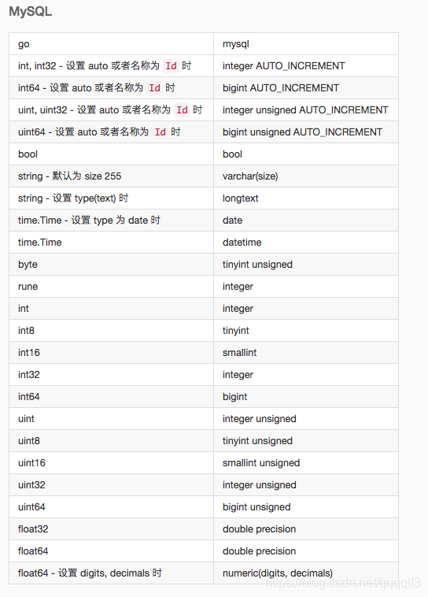

# GO的demo项目

> 第一个demo项目，主要需求是模拟一个银行批量处理文件的客户端
> 就是做一个web服务，对外提供api服务
> 内部做个job，可以逐个文件处理
> 最后回调给调用方

1. 新建一个工程，因为没在GOPATH路径下，所以// go mod init {具体工程名} //用来创建一个新的go module
2. go mod tidy //可以把需要依赖的lib都从远端下载下来，下载到GOPATH的pkg文件夹下
3. go mod vendor //就是把所需的依赖拉到该module下

## 使用的工具如下
- Gin	业务开发	HTTP 框架	⭐️⭐️⭐️⭐️⭐️
- GORM	业务开发	ORM 框架	⭐️⭐️⭐️⭐️⭐
  ️
- errors	业务开发	异常处理库	⭐️⭐️⭐️⭐️⭐️
- zorolog	业务开发	日志库	⭐️⭐️⭐️⭐️⭐️
  > go get -u github.com/rs/zerolog/log
- excelize	业务开发	Excel相关需求	⭐️⭐️⭐️⭐️⭐️
- now	业务开发	时间处理	⭐️⭐️⭐️⭐️️
- Decimal	业务开发	精度处理	⭐️⭐️⭐️⭐️️
- configor	业务开发	配置文件	⭐️⭐️⭐️⭐️️
- go-cache	业务开发	本地缓存	⭐️⭐️⭐️
- copier	业务开发	数据复制	⭐️⭐️⭐️️️
- env	业务开发	环境变量	⭐️⭐️⭐️️️
- user_agent	业务开发	读取 user-agent	⭐️⭐️⭐️️️
- phonenumbers	业务开发	手机号码验证	⭐️⭐️⭐️️️
- gomonkey	基础工具	mock工具	⭐️⭐️⭐️⭐️⭐
- goconvey	基础工具	单测覆盖率	⭐️⭐️⭐️⭐️⭐
- dig	基础工具	依赖注入	⭐️⭐️⭐️⭐️⭐
- cobra	基础工具	命令行工具	⭐️⭐️⭐️⭐
- cli	基础工具	命令行工具	⭐️⭐️⭐️⭐
- BloomRPC	基础工具	gRPC 调试客户端	⭐️⭐️⭐️⭐
- redis	基础工具	Redis 客户端	⭐️⭐️⭐️⭐
- elastic	基础工具	elasticsearch 客户端	⭐️⭐️⭐️⭐
- resty	基础工具	http 客户端	⭐️⭐️⭐️⭐
- pulsar-client-go	基础工具	Pulsar 客户端	⭐️⭐️⭐️
- go-grpc-middleware	基础工具	gRPC 中间件	⭐️⭐️⭐
- go-pilosa	基础工具	pilosa 客户端	⭐️⭐️⭐️
- pb	基础工具	命令行工具进度条	⭐️⭐️⭐️
## 使用的框架如下

1. gorm
> go get -u gorm.io/gorm
> go get -u gorm.io/driver/mysql
> conn, err := gorm.Open(mysql.Open("root:123456@tcp(127.0.0.1:3306)/app_vendor?charset=utf8&parseTime=True&loc=Local&timeout=10s&readTimeout=30s&writeTimeout=60s"), &gorm.Config{})
> 这玩意现在只支持有限的几种数据库，对于Oracle，DB2等还不支持
2. 
